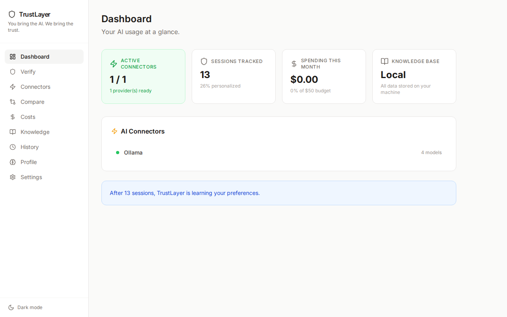

<p align="center">
  <h1 align="center">TrustLayer AI</h1>
  <p align="center"><strong>Trust scores for every AI response. Local-first. Model-agnostic.</strong></p>
</p>

<p align="center">
  <a href="https://pypi.org/project/trustlayer-ai/"></a>
  <a href="https://pypi.org/project/trustlayer-ai/"></a>
  <a href="https://github.com/acunningham-ship-it/trustlayer/blob/main/LICENSE"></a>
  <a href="https://github.com/acunningham-ship-it/trustlayer/stargazers"></a>
</p>

---

TrustLayer sits between your app and any LLM. It verifies outputs, catches hallucinations, tracks token costs, and gives every response a **trust score** -- all running locally on your machine.

Works with **Ollama, Claude, GPT, Gemini** out of the box.

## Features

- **Trust Scoring** -- confidence ratings on every AI response, so you know what to double-check
- **Hallucination Detection** -- flags claims that contradict your source docs or prior context
- **Cost Tracking** -- per-request and cumulative token spend across all providers
- **Local Proxy** -- routes requests through a local server; your data never hits a third-party logging service
- **Multi-Model Support** -- swap between Ollama, OpenAI, Anthropic, and Google models with one config change
- **Dashboard** -- browser-based UI to inspect responses, trust history, and cost breakdowns

## Install

```bash
pip install trustlayer-ai
```

## Quick Start

```python
from trustlayer import TrustLayer

tl = TrustLayer()

result = tl.verify(
    prompt="What is the capital of France?",
    model="ollama/llama3"
)

print(result.answer)        # "Paris"
print(result.trust_score)   # 0.97
print(result.cost_usd)      # 0.0 (local model)
```

## Screenshots

> Screenshots coming soon. Placeholders below.

| Dashboard | Trust History |
|-----------|--------------|
|  |  |

## Comparison

| Feature | TrustLayer | Open WebUI | LiteLLM | PrivateGPT |
|---|:---:|:---:|:---:|:---:|
| Trust scoring per response | Yes | -- | -- | -- |
| Hallucination detection | Yes | -- | -- | Partial |
| Cost tracking | Yes | -- | Yes | -- |
| Local-first proxy | Yes | Yes | Yes | Yes |
| Multi-model routing | Yes | Yes | Yes | -- |
| Python SDK | Yes | -- | Yes | -- |

## Built For

- **Developers** building AI features who need to know when the model is wrong
- **AI/ML teams** tracking spend and reliability across providers
- **Self-hosters** who want full control -- no cloud dependency, no telemetry

## Contributing

Contributions welcome. Open an issue first for anything non-trivial.

```bash
git clone https://github.com/acunningham-ship-it/trustlayer.git
cd trustlayer
pip install -e ".[dev]"
```

## License

MIT
